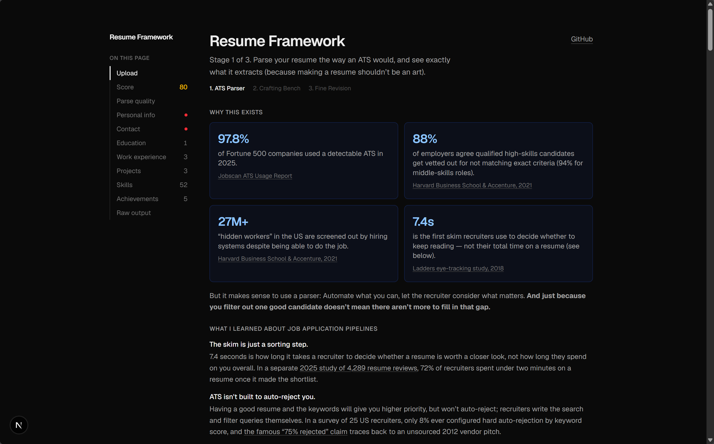
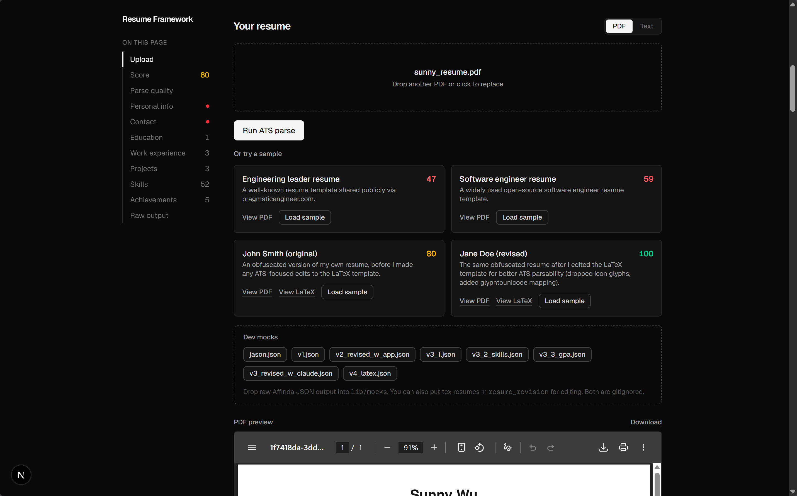
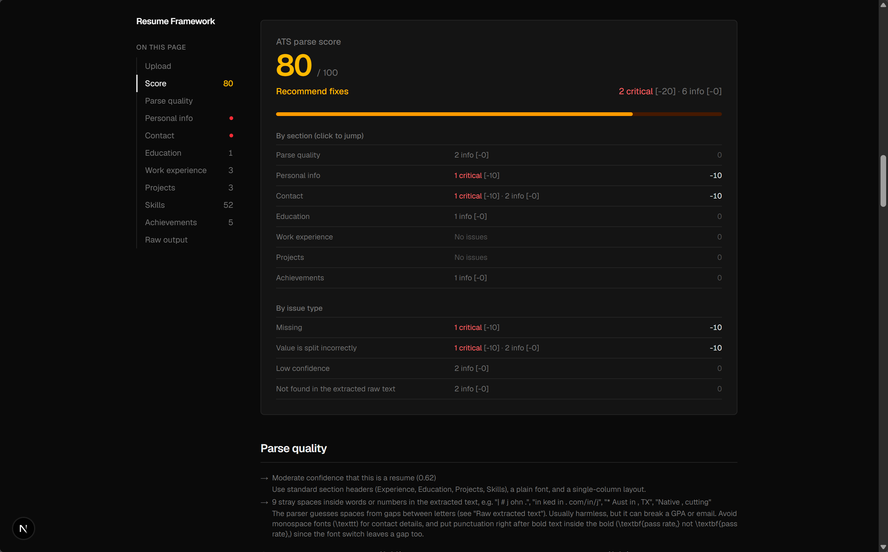
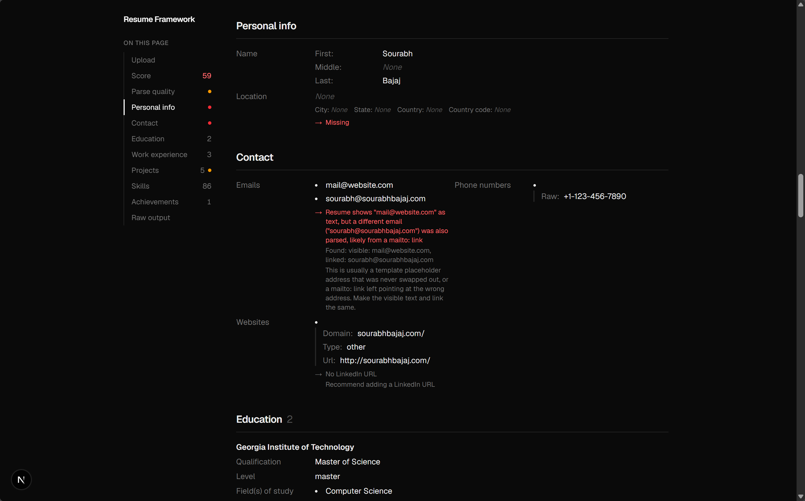

# Resume Framework

Stage 1 of a planned 3-stage tool: an ATS resume parser. Paste your resume
text or upload a PDF, and see exactly what a real resume-parsing engine
(Affinda) extracts from it: contact info, work experience, education,
skills, etc. Just like how an applicant tracking system would. Extracted
fields are reviewed and given a 0-100 parse
score, broken down by section, and tips provided.

## Screenshots

**Landing page**: why an ATS parser matters, with sourced stats



**Upload**: paste text or drop a PDF, or load one of the built-in sample
resumes



**Score**: a 0-100 parse score with a per-section and per-issue-type
breakdown:



**Inline issues**: flagged fields (missing data, mismatched emails,
low-confidence extractions) shown next to the parsed value itself:



## Planned stages

1. **ATS Parser**: parse + display, transparency-first.
2. **Crafting Bench**: The app holds your hand in editing your resume section-by-section, bullet-by-bullet. Need help? AI can help. Results in a database of content to swap in and out.
3. **Fine Revision**: a quick job description keyword substition after Stage 2 for every job you apply for.

The multi-agent review pipeline (Reviser/Sentiment Checker/Recruiter) that
used to live here has been removed to keep the app focused on parsing for
now. See
[`docs/archived-review-pipeline.md`](./docs/archived-review-pipeline.md) for
what it did and how to rebuild it.

## Running it

```bash
npm install
npm run dev
```

Open [http://localhost:3000](http://localhost:3000).

You'll need an [Affinda API key](https://www.affinda.com/) set as
`AFFINDA_API_KEY` in `.env.local`. the parse request is made server-side
(`app/api/ats-parse/route.ts`).

## Using it

1. Choose **Text** or **PDF** and provide your resume, or click **Load
   sample** on one of the built-in sample resumes.
2. Click **Run ATS parse**. You'll get a 0-100 **ATS parse score** (with a
   by-section and by-issue-type breakdown), plus a formatted breakdown
   (contact/personal info, education, work experience, projects, skills,
   achievements) with issues flagged inline next to the field they apply
   to, and the raw parser JSON at the bottom.
3. The sticky section nav on the side jumps to each section and shows
   entry counts plus a dot for any section with flagged issues.
4. In dev, a **Dev mocks** panel lists any JSON files dropped into
   `lib/mocks` and loads one straight into the app without hitting the API.

## Tech stack

Next.js (App Router) + TypeScript + Tailwind CSS. `app/api/ats-parse/route.ts`
proxies the resume to Affinda's resume-parser API server-side.

For architecture details and where to look when extending this app, see
[`CLAUDE.md`](./CLAUDE.md).
